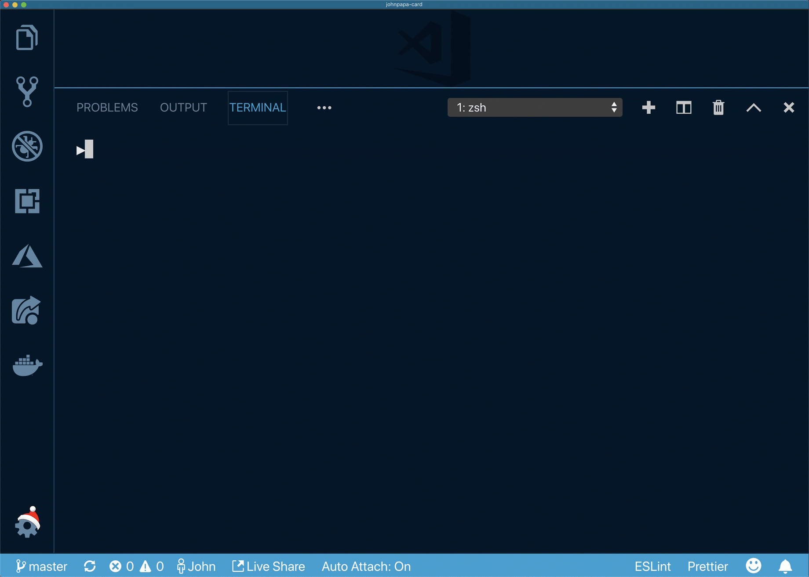

# John Papa's Card

It's me, John!

## Usage

Via npx:

```bash
npx @johnpapa/card
```

Not including how to use it globally because I'm not sure why you'd want this as a global command. That'd be creepy.

## Credits

Forked from Tierney Cyren's https://github.com/bnb/bitandbang


